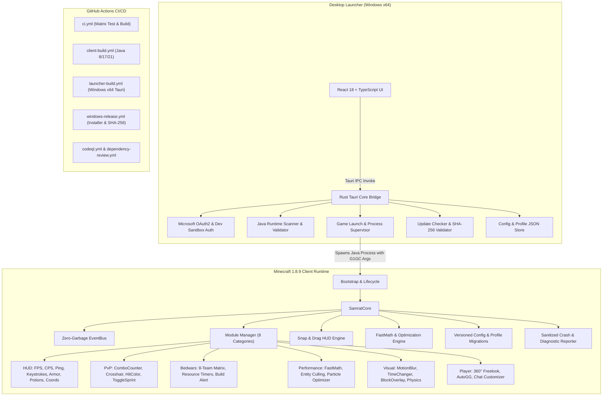

# SAMRAT CLIENT ECOSYSTEM ARCHITECTURE

## High-Level System Architecture

## System Boundaries & Principles

1. **GitHub-First Toolchain**: Developers do not need any SDKs or compilers installed locally. Clean GitHub-hosted runners handle compilation, testing, static analysis, packaging, and releases.
2. **Strict Legitimacy**: 100% compliant with Minecraft server rules. No KillAura, aim assist, velocity hacks, or authentication bypasses.
3. **Zero Token Leakage**: Passwords and OAuth access tokens are scrubbed from all logs, stack traces, and crash dumps.
4. **Performance by Measurement**: Includes built-in benchmark screens (averages, 1% lows, 0.1% lows, memory allocation) and FastMath lookup tables.
