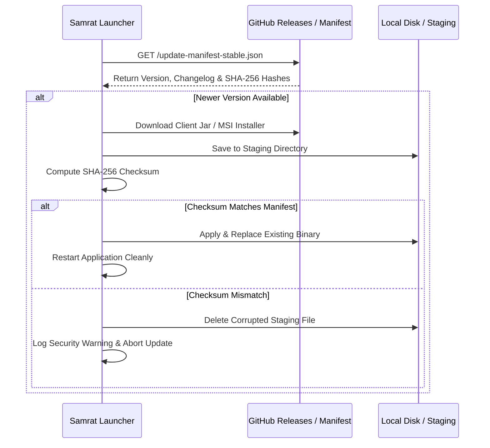

# Update Integrity & Verification System

## Update Architecture

## Manifest Schema

Manifests must adhere to the JSON schema defined in [`shared/schemas/update-manifest.schema.json`](file:///c:/Github/Launcher/shared/schemas/update-manifest.schema.json).
Each artifact entry must specify:
- `url`: Direct HTTPS download link
- `sha256`: 64-character hexadecimal SHA-256 hash
- `sizeBytes`: Exact binary size in bytes
